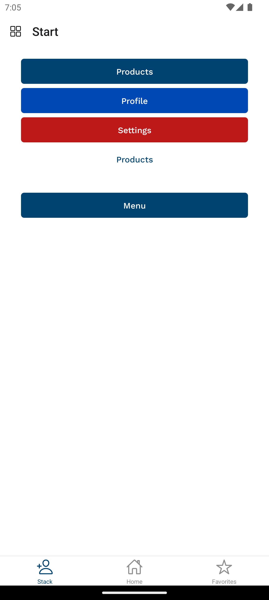

# Navigation App

**Navigation App** with expo in react native.

## Installation

To get started the App, follow these steps:

1. Clone the repository:
   ```bash
   git clone https://github.com/sLiMFly/navigation-app.git
   ```
2. Install the dependencies:
   ```bash
   npm install
   ```
3. Run the app:
   ```bash
   npm start
   ```

## Usage

Once opened, you can press "a" key to open in virtual device Android, press "i" for iOS, press "w" to view on the web, or scan the QR code on a physical device.

## Screenshots

<p align="center">
    
    
    
    

</p>
